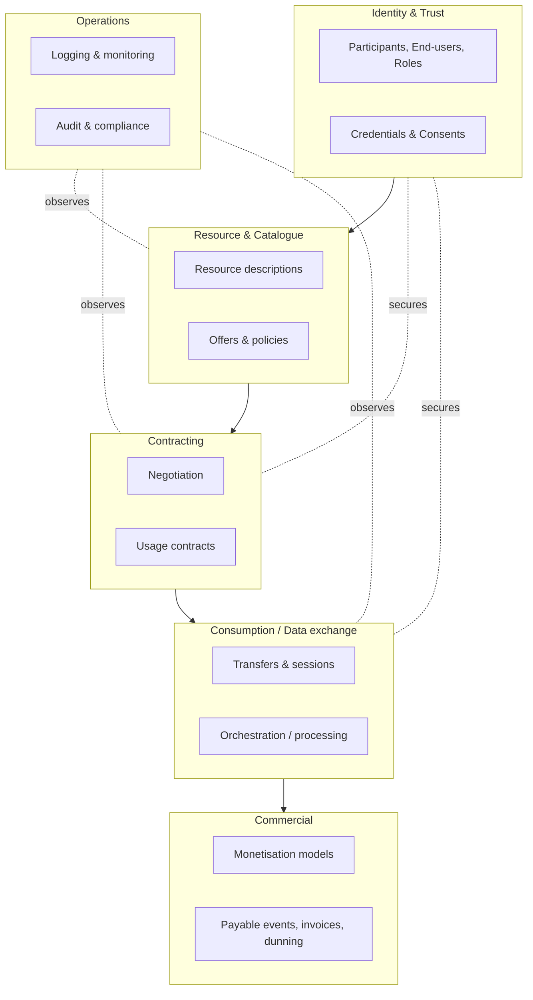
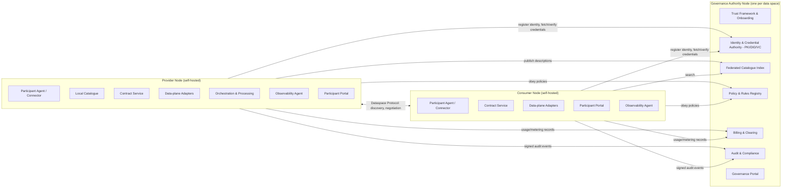
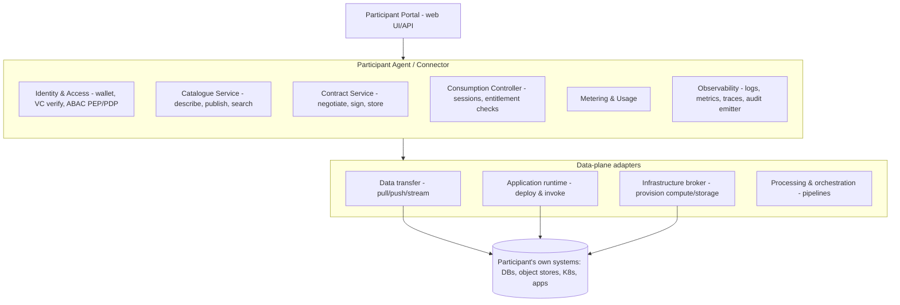
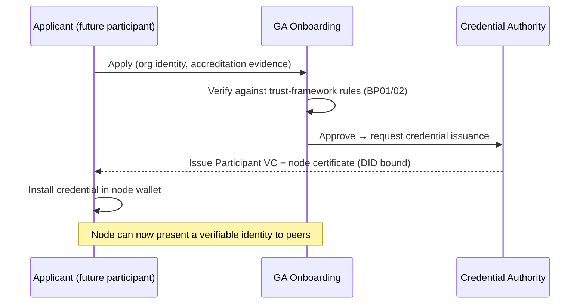
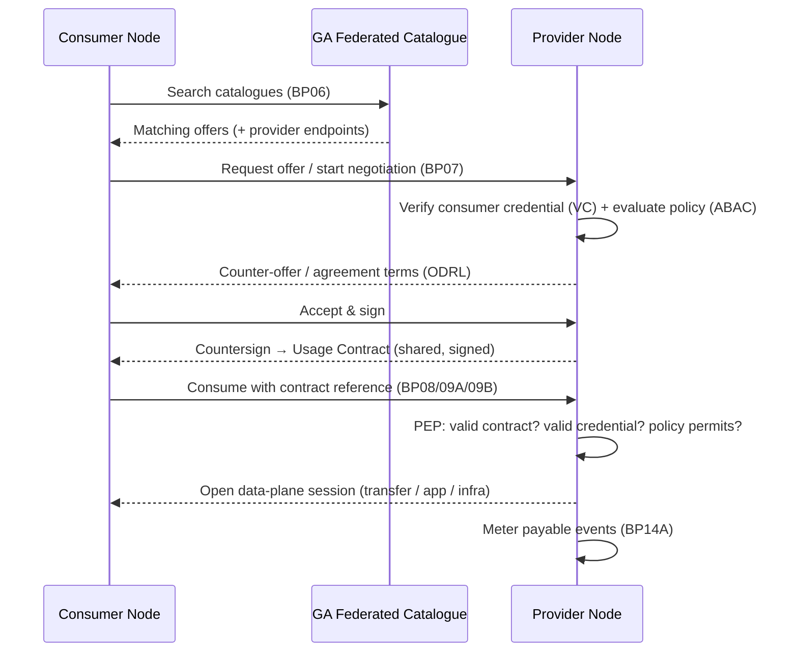
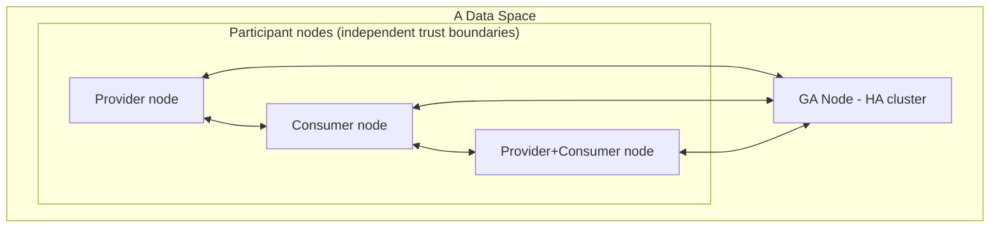

# Simpl — High-Level Architecture Design Proposal

> **Status:** Draft proposal for discussion
> **Author:** Independent design worked out from the published business requirements
> **Source of requirements:** *Simpl Requirements* — https://simpl-programme.ec.europa.eu/book-page/simpl-requirements
> **Scope:** A greenfield, first-principles proposal for the smart middleware that powers European data spaces (data / application / infrastructure sharing across a federation). This is **not** a description of any existing implementation; it is a clean-room design derived from the requirements alone.

---

## 1. Purpose & reading guide

This document proposes a **high-level architecture** for a middleware ("the platform") that lets independent organisations form and operate a **data space**: a federated ecosystem in which providers offer data, application and infrastructure resources, consumers discover and use them under contracts, and a Governance Authority sets and enforces the rules of trust.

It is written top-down:

1. **What the system must do** — a compact restatement of the requirements (§2) and the forces that shape the design (§3).
2. **How it is organised** — domain model (§4), the federated node topology (§5), and the building blocks inside a node (§6).
3. **How it behaves** — the end-to-end flows that stitch the blocks together (§7), and the trust/security spine that runs through all of them (§8).
4. **How it fits the world** — interoperability and standards (§9), deployment (§10), technology choices (§11).
5. **How we know it's right** — NFR strategy (§12), a requirements-to-component traceability matrix (§13), a delivery roadmap (§14), and risks/open questions (§15).

If you only read one section, read **§5 (topology)** and **§6 (building blocks)** — they carry the load-bearing decisions.

---

## 2. Requirements, restated

### 2.1 Actors

| Actor | Responsibility |
|---|---|
| **Governance Authority (GA)** | The trust anchor and rule-maker of a data space. Defines governance, onboards participants, issues/revokes credentials, sets metadata-quality and monetisation rules, audits participants, and operates space-wide services (identity, catalogue, billing). |
| **Provider** | An onboarded organisation that publishes resources. Sub-types by what they offer: **Data Provider**, **Application Provider**, **Infrastructure Provider**. |
| **Consumer** | An onboarded organisation that searches for and consumes resources under usage contracts. |
| **End-User** | A person acting inside a participant organisation; granted roles and consents; the human at the keyboard. |
| **Participant** | Umbrella term for any onboarded organisation (a provider and/or consumer) that runs a node in the federation. |

### 2.2 Capabilities (business processes)

Grouped from the requirements' BP/SA catalogue:

- **Governance & setup:** define data-space governance (BP01); configure the GA (BP02).
- **Onboarding & identity:** onboard providers/consumers/infrastructure participants (BP03A); onboard end-users (BP03B); end-user role requests (BP03C); credential actions by the GA (SA03); consent assertion management (SA09).
- **Resource lifecycle:** provider manages resource descriptions (BP05B); metadata-quality rules (SA06); deployment-script management (SA04).
- **Discovery:** consumer searches catalogues (BP06).
- **Contracting:** consumer & provider establish usage contracts (BP07).
- **Consumption:** consume infrastructure (BP08), data (BP09A), application (BP09B) resources; data orchestration (SA01); data-processing services (SA02); application orchestration (SA08).
- **Operations:** single-node logging & monitoring (BP12B); GA audits participants (BP12D); IT administration (BP13).
- **Commercial:** monetisation-model configuration (SA11); billing, payable-event detection, dunning (BP14 / BP14A / BP14B).

### 2.3 Non-functional requirements (the 15 qualities)

Accessibility · Availability · Composability & extensibility · Discoverability · Federation · Interoperability · Loose coupling · Maintainability · Modularity · Openness & agnosticism · Reliability · Resilience · Scalability & elasticity · Security, privacy & trust · Usability.

These are treated as **first-class architectural drivers**, not afterthoughts (see §3 and §12).

---

## 3. Architectural drivers & guiding principles

The NFRs collapse into a handful of load-bearing decisions:

1. **Federation over centralisation.** *Federation, loose coupling, resilience, scalability.* No single runtime is on the critical path of a data exchange. The GA is a **trust and coordination authority**, not a data broker. Data flows **peer-to-peer** between participant nodes.

2. **Control plane vs. data plane separation.** *Scalability, security, resilience.* Discovery, contracting, identity and policy (control plane) are separate from the movement of bytes (data plane). The control plane is small, chatty and consistency-sensitive; the data plane is large, high-throughput and can be optimised/replaced independently.

3. **Self-sovereign nodes ("bring your own runtime").** *Openness & agnosticism, composability.* Each participant runs their own node (a **Participant Agent/Connector**) inside their own trust boundary. The platform ships the node as a set of composable, independently deployable services rather than a monolith.

4. **Contract-before-access, everywhere.** *Security, privacy & trust.* Nothing of value moves without (a) a verifiable identity, (b) a machine-readable usage policy, and (c) a signed usage contract. Enforcement is **decentralised** — the provider's node enforces the provider's rules at the point of consumption.

5. **Everything described by standard, machine-readable metadata.** *Interoperability, discoverability.* Resources, policies, credentials and offers use open vocabularies (DCAT, ODRL, W3C VC/DID, JSON-LD) so that catalogues, contracts and credentials are portable across data spaces.

6. **Modular, replaceable building blocks with stable contracts.** *Modularity, maintainability, extensibility.* Each capability is a bounded service behind a versioned API/event contract. Any block can be swapped (a different catalogue engine, a different billing backend) without touching its neighbours.

7. **Secure by construction, observable by default.** *Reliability, availability, security.* mTLS everywhere, zero-trust between services, signed audit events, and OpenTelemetry-based observability baked into every block.

**Architectural style:** microservices/building-blocks per node, event-driven where flows are asynchronous (onboarding, billing, audit), request/response for synchronous flows (search, contract negotiation). Cross-node communication uses **standard federation protocols**, never private APIs.

---

## 4. Domain model (bounded contexts)

The problem decomposes into eight bounded contexts. These map almost one-to-one onto the building blocks in §6.

**Ubiquitous language (glossary):**

- **Resource** — a data set, application/service, or infrastructure capacity offered into the space.
- **Resource Description** — standardised metadata about a resource (what it is, quality, access endpoint, semantics).
- **Offer** — a resource description bound to one or more **usage policies** and (optionally) a price.
- **Usage Policy** — machine-readable permissions, prohibitions and obligations (ODRL) governing a resource.
- **Usage Contract** — an agreed, signed instance of an offer between a specific consumer and provider; the authorisation basis for consumption.
- **Credential** — a verifiable claim (VC) about a participant or end-user (identity, role, accreditation).
- **Consent** — an end-user's recorded permission for a specific processing/sharing purpose.
- **Node / Participant Agent** — the deployable software a participant runs to join the space.
- **Payable Event** — a metered, contract-bound act of consumption that produces a billing record.

---

## 5. Logical architecture — the federated topology

Two node archetypes, connected by standard federation protocols.

### 5.1 Governance Authority (GA) node — one per data space

The GA node hosts the **space-wide, authoritative** functions. It is the root of trust but deliberately **off the data path**:

- **Trust Framework & Onboarding** — codifies BP01/BP02 governance as machine-readable rules; runs onboarding workflows (BP03A/B/C).
- **Identity & Credential Authority** — PKI root/intermediate CAs, DID registry, verifiable-credential issuance and revocation (SA03).
- **Federated Catalogue Index** — a searchable, space-wide index that federates over participants' local catalogues (supports BP06). Holds metadata/pointers, never the underlying data.
- **Policy & Rules Registry** — publishes metadata-quality rules (SA06), monetisation-model templates (SA11), and space-level policies.
- **Billing & Clearing** — aggregates payable events from participants, produces invoices, runs dunning rules (BP14/14A/14B).
- **Audit & Compliance** — collects signed audit trails, runs participant audits (BP12D).
- **Governance Portal** — the GA operator's UI (BP13).

The GA can itself be deployed **highly-available and horizontally scaled**; its subsystems are independent services so a busy catalogue index doesn't affect credential issuance.

### 5.2 Participant node (Provider / Consumer) — self-hosted, many

A single deployable stack that a participant runs in their own environment. Providers and consumers run the **same** node with different features enabled — this keeps the platform modular and lets an organisation be both. Its heart is the **Participant Agent (Connector)**: the only component that talks to other nodes, and the single choke-point where identity, policy and contract are enforced.

### 5.3 Why this split

- **Federation & sovereignty:** data never transits the GA; each participant keeps custody inside its own boundary.
- **Resilience:** a GA outage stops *new* onboarding/contracts but does **not** stop *existing* contracted data flows (nodes cache the credentials and contracts they need).
- **Scalability:** the heavy data plane scales at the edges (participants), independently of the control plane.

---

## 6. Building blocks (inside a participant node)

Each block is an independently deployable service with a versioned API and/or event contract.

| Block | Responsibility | Serves |
|---|---|---|
| **Identity & Access (IAM)** | Holds the node's DID + keypair and credential **wallet**; verifies counterparties' credentials; hosts the **Policy Decision Point (PDP)** and **Policy Enforcement Points (PEP)** for attribute-based access control (ABAC); manages end-user auth (OIDC), roles (BP03C) and consents (SA09). | Trust spine (§8) |
| **Catalogue Service** | Local authoring/validation of resource descriptions (BP05B) against metadata-quality rules (SA06); publishes to the GA federated index; answers federated search queries (BP06). | Discovery |
| **Contract Service** | Runs offer→negotiation→agreement state machine (BP07); binds offers to ODRL usage policies; stores signed contracts as the authorisation record. | Contracting |
| **Consumption Controller** | For each consumption request, checks a valid **contract + credential + policy** before opening a data-plane session (BP08/09A/09B); the runtime PEP. | Access control |
| **Data-plane adapters** | Pluggable movers/executors: **Data transfer** (batch/stream/query), **Application runtime** (deploy & run app resources, SA08), **Infrastructure broker** (provision compute/storage, BP08), **Processing & orchestration** (SA01/SA02 pipelines, deployment scripts SA04). | Consumption |
| **Metering & Usage** | Records payable events per contract (BP14A), emits usage to GA billing. | Commercial |
| **Observability** | Structured logs, metrics, traces (BP12B); emits **signed, tamper-evident audit events** to the GA (feeds BP12D). | Operations |
| **Participant Portal** | Human/API surface for the org's admins and end-users; role requests, browsing, contract approvals, dashboards. | Usability, IT admin (BP13) |

**Composability in practice:** the data-plane adapters are the main extension point. Supporting a new kind of resource (say, a new streaming protocol or a GPU-infrastructure provider) means adding an adapter behind the stable `Consumption Controller → adapter` contract, with no change to identity, catalogue or contracting.

---

## 7. Key end-to-end flows

### 7.1 Onboarding a participant (BP03A, SA03)

End-user onboarding (BP03B) and role requests (BP03C) follow the same shape but issue **end-user** credentials/roles inside the participant's own IAM, governed by GA-published rules.

### 7.2 Publishing a resource (BP05B, SA06)

Provider authors a **resource description** in the local Catalogue Service → validated against GA metadata-quality rules → bound to an **offer** (ODRL policy + optional price from a monetisation template, SA11) → published to the GA **Federated Catalogue Index** (metadata only).

### 7.3 Discover → contract → consume (BP06 → BP07 → BP08/09)

The **data-plane session** (bytes, application calls, provisioned infra) is direct provider↔consumer; the GA is not involved.

### 7.4 Billing & dunning (BP14 / BP14A / BP14B, SA11)

Metering emits payable events → GA **Billing & Clearing** rates them against the contract's monetisation model → generates invoices → applies **dunning rules** for overdue amounts. Clearing between many providers/consumers is centralised at the GA for a coherent commercial view.

### 7.5 Monitoring & audit (BP12B, BP12D)

Every node's Observability agent produces local logs/metrics/traces (BP12B) **and** emits signed, append-only audit events to the GA. The GA **Audit & Compliance** service reconstructs cross-participant trails to run participant audits (BP12D) without needing access to the underlying data.

---

## 8. Trust & security architecture (the spine)

Security, privacy & trust is the requirement that touches every flow, so it is designed as one coherent spine rather than per-feature.

- **Identity:** every participant and node has a **Decentralised Identifier (DID)** and an X.509 node certificate chained to the GA's PKI. End-users authenticate via **OIDC** inside their organisation.
- **Verifiable claims:** roles, accreditations and attributes travel as **W3C Verifiable Credentials**, held in each node's **wallet**, presented on demand, and checkable offline against the GA's revocation registry.
- **Zero-trust transport:** all node-to-node and service-to-service traffic is **mutual TLS**; no implicit trust from network location.
- **Policy & authorisation (ABAC):** access decisions are attribute-based (identity + role + contract + resource + context) rather than static roles. Each node runs a **PDP**; **PEPs** sit at the Consumption Controller and Catalogue read paths. Policies are expressed in a standard language (ODRL for usage, a policy engine such as OPA/Rego for infrastructure ABAC) and can be updated centrally (GA Policy Registry) yet enforced locally.
- **Contract as authorisation:** a signed Usage Contract is the *only* basis for opening a data-plane session; the PEP re-checks it at consumption time, so revocation/expiry takes effect immediately.
- **Consent:** end-user consents (SA09) are recorded, versioned and referenced by processing operations; withdrawal propagates to the PDP.
- **Tamper-evidence:** audit events are signed and hash-chained so the GA (and auditors) can detect gaps or edits.
- **Privacy & data minimisation:** the GA holds **metadata and pointers only**; personal/business data never leaves the participant's boundary except under a contract, directly to the counterparty.

**Threat posture:** compromised node → limited blast radius (its contracts/credentials only, revocable at GA); compromised GA → cannot silently read data (it never holds it) though it can disrupt onboarding/clearing, so the GA is the most hardened and most redundant tier.

---

## 9. Interoperability & standards

Openness and interoperability are met by **adopting existing open standards** rather than inventing formats:

| Concern | Standard(s) |
|---|---|
| Node-to-node discovery, negotiation, transfer | **Dataspace Protocol** (IDSA) / IDS connector semantics |
| Resource metadata / catalogues | **DCAT** (DCAT-AP), JSON-LD, SKOS vocabularies |
| Usage policies / contracts | **ODRL** |
| Identity | **W3C DID**, X.509 PKI |
| Credentials | **W3C Verifiable Credentials**, Gaia-X-style trust framework & compliance claims |
| End-user auth | **OpenID Connect / OAuth 2.0** |
| Observability | **OpenTelemetry** (logs/metrics/traces) |
| APIs | **OpenAPI** (REST), async via CloudEvents |

Aligning with **IDSA (Dataspace Protocol)** and **Gaia-X** trust concepts makes nodes interoperable with the wider European data-space ecosystem, so a participant can potentially join more than one space with one node — directly serving *federation* and *openness & agnosticism*.

---

## 10. Deployment topology

- **Packaging:** every building block is a container; a node is a **Helm chart / Kubernetes** deployment (with a lightweight docker-compose profile for small participants and dev).
- **Participant node:** runs inside the participant's own cloud/on-prem trust boundary. Stateless services scale horizontally; state (contracts, catalogue, wallet keys) in the participant's own datastore + secrets manager/HSM for keys.
- **GA node:** multi-AZ, horizontally scaled; each subsystem independently scalable; the PKI root kept offline/HSM-backed, intermediates online.
- **Data plane:** provider-side; can be scaled/placed close to the data (edge, region) independently of the control plane.
- **Agnosticism:** no hard dependency on a specific cloud; storage/compute abstracted behind adapters. A participant can run entirely on-prem.

---

## 11. Technology choices (reference, not mandate)

Chosen to honour *openness & agnosticism* — all open, all replaceable behind the block contracts.

| Layer | Reference choice | Why |
|---|---|---|
| Runtime/orchestration | Kubernetes + Helm | Portable, scalable, cloud-agnostic |
| Service language | JVM (Java/Kotlin) or Go for agents | Strong ecosystem for connectors, crypto, gRPC |
| Inter-service | REST/OpenAPI + async events (Kafka/NATS + CloudEvents) | Sync where needed, decoupled where not |
| Identity/PKI | Step-CA/EJBCA-class CA, DID + VC libraries | Standards-based trust |
| Policy engine | Open Policy Agent (Rego) for ABAC + ODRL evaluator | Central authoring, local enforcement |
| Catalogue index | Search engine (OpenSearch/Elastic) + graph/triple store for semantics | Fast federated search over DCAT metadata |
| Datastores | PostgreSQL (contracts, metadata), object store (payloads) | Reliable, ubiquitous |
| Observability | OpenTelemetry + Prometheus + Loki/Tempo/Grafana | BP12B out of the box |
| Secrets/keys | HSM / KMS + Vault | Key protection for signing & mTLS |

---

## 12. How the non-functional requirements are met

| NFR | Where it is delivered |
|---|---|
| **Accessibility** | Portal built to WCAG; APIs are the primary surface so any accessible client works. |
| **Availability** | Stateless, horizontally scaled services; GA in HA; data flows survive GA downtime via cached credentials/contracts (§5.3). |
| **Composability & extensibility** | Building blocks behind versioned contracts; data-plane adapter model (§6). |
| **Discoverability** | Federated Catalogue Index + DCAT metadata + search (§5.1, §7.2). |
| **Federation** | Two-tier topology; standard federation protocol; no central data path (§5). |
| **Interoperability** | Open standards throughout (§9). |
| **Loose coupling** | Event-driven where possible; nodes interact only via standard protocols. |
| **Maintainability** | Independent services, clear bounded contexts (§4), OpenAPI contracts. |
| **Modularity** | One capability = one block; providers/consumers share one node with features toggled (§5.2). |
| **Openness & agnosticism** | Open standards + open-source references; cloud/on-prem neutral (§10–11). |
| **Reliability** | Contract-checked, idempotent operations; signed audit; at-least-once eventing with dedup. |
| **Resilience** | Blast-radius containment (§8); local caches; retries/circuit breakers between nodes. |
| **Scalability & elasticity** | Control/data plane split (§3.2); data plane scales at the edge; K8s autoscaling. |
| **Security, privacy & trust** | The whole of §8; metadata-only GA; contract-before-access. |
| **Usability** | Participant Portal, guided onboarding/contract flows, sensible defaults. |

---

## 13. Requirements → component traceability

| Requirement | Primary component(s) |
|---|---|
| BP01 Define governance | GA Trust Framework & Onboarding |
| BP02 Configure GA | GA Governance Portal / Trust Framework |
| BP03A Onboard participants | GA Onboarding + Credential Authority; node IAM/wallet |
| BP03B Onboard end-users | Participant IAM (OIDC) under GA rules |
| BP03C End-user role requests | Participant IAM + Portal |
| BP05B Manage resource descriptions | Catalogue Service |
| BP06 Search catalogues | GA Federated Catalogue Index + Catalogue Service |
| BP07 Usage contracts | Contract Service (both nodes) |
| BP08 Consume infrastructure | Consumption Controller + Infrastructure broker adapter |
| BP09A Consume data | Consumption Controller + Data-transfer adapter |
| BP09B Consume application | Consumption Controller + Application-runtime adapter |
| BP12B Node logging & monitoring | Observability agent |
| BP12D GA audits participants | GA Audit & Compliance |
| BP13 IT administration | Participant/Governance Portals |
| BP14 / 14A / 14B Billing / payable events / dunning | Metering (node) + GA Billing & Clearing |
| SA01/SA02 Data orchestration/processing | Processing & orchestration adapter |
| SA03 Credential actions | GA Credential Authority |
| SA04 Deployment scripts | Orchestration adapter + Policy Registry |
| SA06 Metadata quality rules | GA Policy Registry + Catalogue validation |
| SA08 Application orchestration | Application-runtime adapter |
| SA09 Consent assertions | Participant IAM (consent store) |
| SA11 Monetisation models | GA Policy Registry (templates) + Contract Service (pricing) |

---

## 14. Delivery roadmap (phased)

1. **Phase 0 — Trust foundation.** GA node minimal: onboarding + Credential Authority (PKI/DID/VC); node IAM/wallet; mTLS. *Outcome: two nodes can prove identity to each other.*
2. **Phase 1 — Describe & discover.** Catalogue Service + GA Federated Catalogue Index + DCAT metadata + search (BP05B, BP06, SA06).
3. **Phase 2 — Contract & consume (data).** Contract Service (ODRL, BP07) + Consumption Controller + Data-transfer adapter (BP09A) + Observability (BP12B).
4. **Phase 3 — Application & infrastructure resources.** App-runtime and Infrastructure-broker adapters (BP08/BP09B, SA04/SA08); orchestration/processing (SA01/SA02).
5. **Phase 4 — Commercial & governance depth.** Monetisation (SA11), billing/dunning (BP14*), audit (BP12D), consent lifecycle (SA09), advanced governance (BP01/02).

Each phase delivers an end-to-end vertical slice across ≥2 nodes and the GA, keeping the federation demonstrable throughout.

---

## 15. Risks & open questions

- **Federated search freshness vs. sovereignty.** How much metadata is centralised in the GA index vs. queried live from nodes? Proposal: cache descriptions centrally, resolve live for sensitive/volatile fields. *Open: staleness SLAs.*
- **Contract semantics interoperability.** ODRL is expressive but under-standardised for obligations enforcement. *Open: which ODRL profile, and how obligations are technically enforced at the PEP.*
- **GA as availability bottleneck for onboarding/billing.** Mitigated by HA + offline credential verification, but clearing is inherently central. *Open: acceptable RPO/RTO for billing.*
- **Key management burden on small participants.** HSM/KMS may be heavy for small orgs. *Open: a GA-hosted "managed node" option without compromising sovereignty.*
- **Multi-space membership.** One node in several data spaces implies multiple trust roots and credential sets. *Open: wallet and policy isolation model across spaces.*
- **Data-plane enforcement limits.** Once bytes are delivered, usage-control obligations ("delete after 30 days") are only as strong as the counterparty's honesty or added tech (TEEs, watermarking). *Open: how far to go on usage control.*

---

### One-paragraph summary

A Simpl-style middleware is best built as a **two-tier federation**: a hardened, metadata-only **Governance Authority** that anchors trust (identity, credentials, catalogue index, policy, billing, audit) and, at the edges, **self-sovereign participant nodes** whose **Agent/Connector** enforces *identity + policy + signed contract* before any peer-to-peer data-plane exchange. Splitting a small, consistency-sensitive **control plane** from a large, throughput-oriented **data plane**, describing everything with **open standards** (DCAT/ODRL/VC/DID/Dataspace-Protocol), and packaging each capability as a **replaceable building block** is what lets the design satisfy the fifteen non-functional qualities — above all *federation, security & trust, interoperability, and scalability* — at once.
